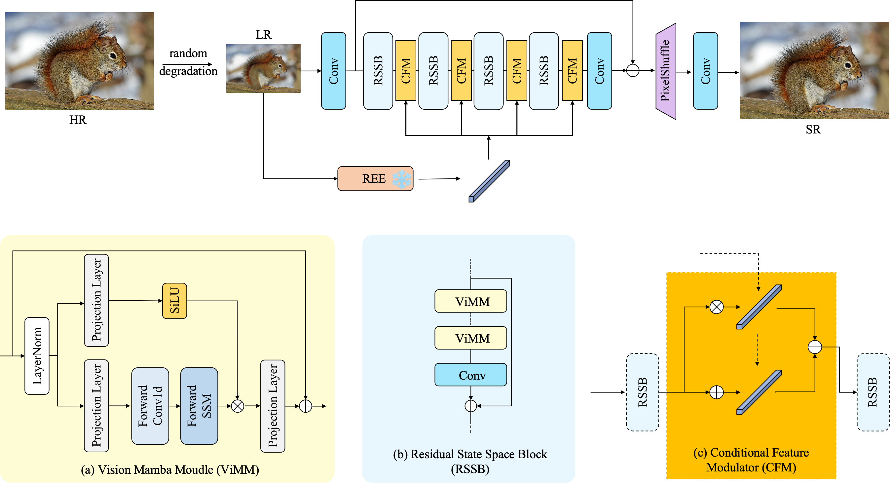
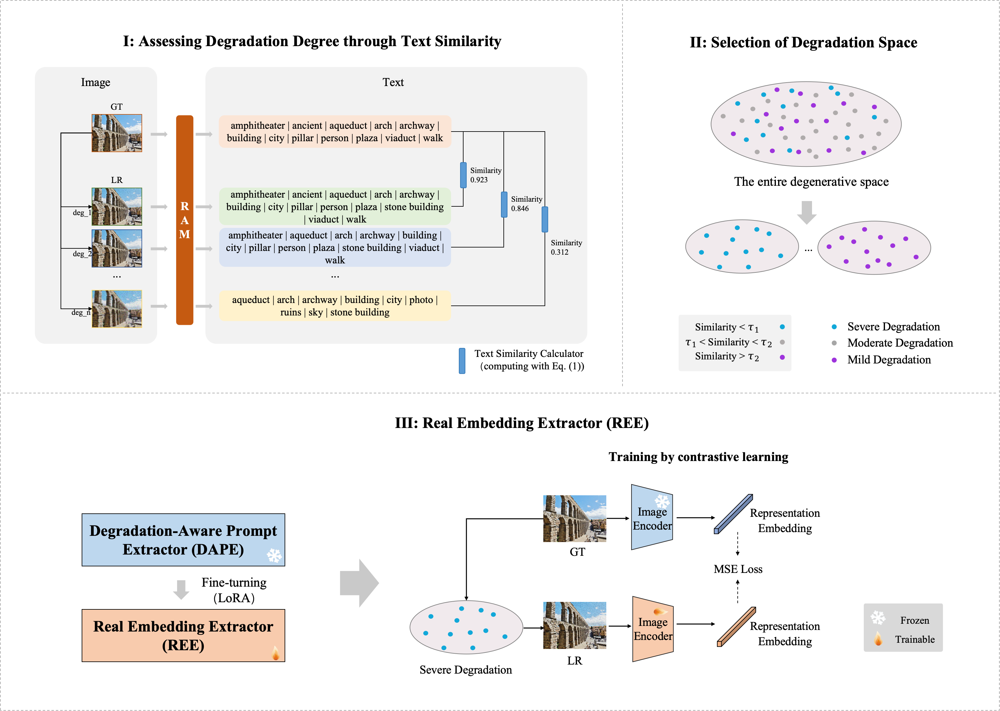

# DACESR

### [Paper(TIP)](https://ieeexplore.ieee.org/abstract/document/11433537) | [Paper(arXiv)](https://arxiv.org/pdf/2602.23890)

> **DACESR: Degradation-Aware Conditional Embedding for Real-World Image Super-Resolution** <br>
> [Xiaoyan Lei](https://scholar.google.com/citations?hl=zh-CN&user=o8GJ_YMAAAAJ/), [Wenlong Zhang](https://wenlongzhang0517.github.io/), [Biao Luo](https://scholar.google.com/citations?user=YKgO7ZQAAAAJ&hl=en), [Hui Liang](), [Weifeng Cao]() and [Qiuting Lin](). <br>
> In TIP.

### Abstract

Multimodal large models have shown excellent ability in addressing image super-resolution in real-world scenarios by leveraging language class as condition information, yet their abilities in degraded images remain limited. In this paper, we first revisit the capabilities of the Recognize Anything Model (RAM) for degraded images by calculating text similarity. We find that directly using contrastive learning to fine-tune RAM in the degraded space is difficult to achieve acceptable results. To address this issue, we employ a degradation selection strategy to propose a Real Embedding Extractor (REE), which achieves significant recognition performance gain on degraded image content through contrastive learning. Furthermore, we use a Conditional Feature Modulator (CFM) to incorporate the high-level information of REE for a powerful Mamba-based network, which can leverage effective pixel information to restore image textures and produce visually pleasing results. Extensive experiments demonstrate that the REE can effectively help image super-resolution networks balance fidelity and perceptual quality, highlighting the great potential of Mamba in real-world applications. 

Overall pipeline of the DACESR:



The training pipeline of the Real Embedding Extractor (REE):



For more details, please refer to our paper.

#### Getting started

- Clone this repo.
```bash
git clone https://github.com/nathan66666/DACESR.git
cd DACESR
```

- Install dependencies. (Python 3 + NVIDIA GPU + CUDA. Recommend to use Anaconda)
```bash
pip install -r requirements.txt
```

- Prepare the training and testing dataset by following this [instruction](datasets/README.md).
- Download the pretrained [RAM](https://huggingface.co/spaces/xinyu1205/recognize-anything/blob/main/ram_swin_large_14m.pth).

#### Training

First, check and adapt the yml file ```options/train/DACESR/train_DACESR.yml```, then

- Single GPU:
```bash
PYTHONPATH="./:${PYTHONPATH}" CUDA_VISIBLE_DEVICES=0 python dacesr/train.py -opt options/train/DACESR/train_DACESR.yml --auto_resume
```

- Distributed Training:
```bash
PYTHONPATH="./:${PYTHONPATH}" CUDA_VISIBLE_DEVICES=0,1,2,3 python -m torch.distributed.launch --nproc_per_node=4 --master_port=4335 dacesr/train.py -opt options/train/DACESR/train_DACESR.yml --launcher pytorch --auto_resume

```

Training files (logs, models, training states and visualizations) will be saved in the directory ```./experiments/{name}```

#### Testing

First, check and adapt the yml file ```options/test/DACESR/test_DACESR.yml```, then run:
```bash
PYTHONPATH="./:${PYTHONPATH}" CUDA_VISIBLE_DEVICES=0 python basicsr/test.py -opt options/test/DACESR/test_DACESR.yml
```

Evaluating files (logs and visualizations) will be saved in the directory ```./results/{name}```

### License

This project is released under the Apache 2.0 license.

### Citation
```
@ARTICLE{11433537,
  author={Lei, Xiaoyan and Zhang, Wenlong and Luo, Biao and Liang, Hui and Cao, Weifeng and Lin, Qiuting},
  journal={IEEE Transactions on Image Processing}, 
  title={DACESR: Degradation-Aware Conditional Embedding for Real-World Image Super-Resolution}, 
  year={2026},
  volume={35},
  number={},
  pages={2997-3008},
  keywords={Degradation;Superresolution;Random access memory;Image restoration;Image recognition;Noise;Feature extraction;Accuracy;Training;Diffusion models;Image super-resolution;multimodal large model;contrastive learning;Mamba-based network;real-world applications},
  doi={10.1109/TIP.2026.3671639}}
```

### Acknowledgement
This project is built based on the excellent [BasicSR](https://github.com/xinntao/BasicSR) project.

### Contact
Should you have any questions, please contact me via `xyan_lei@163.com`.
